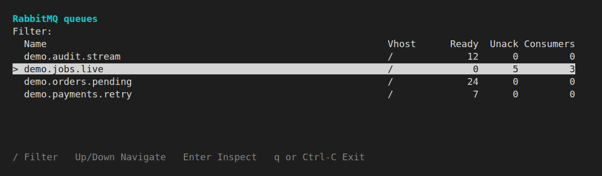
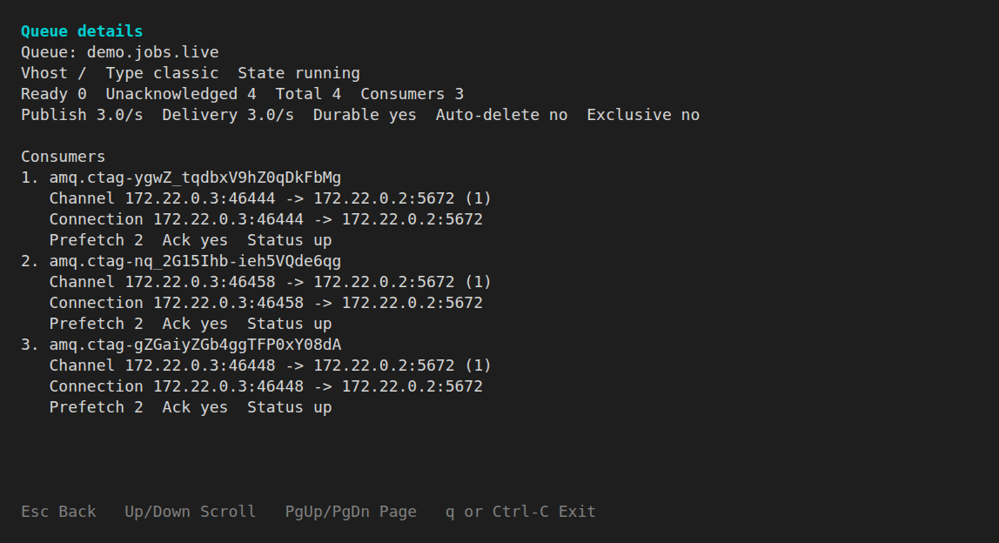

# Building with Symfony TUI: a live RabbitMQ inspector

Symfony TUI caught my attention during [Fabien Potencier's SymfonyLive Paris talk](https://live.symfony.com/2026-paris/schedule/keynote), especially his coding-agent demonstration. An interactive terminal application built with Symfony looked fun to make. I wanted to find out how much time I would spend on the interaction and how much on the terminal itself.

I built a small RabbitMQ queue inspector. You can move between queues while their counts update, type a filter, and open the selected queue's detail. The interesting part is being able to keep doing those things while an HTTP request is pending.




The demo has a publisher and consumers working on `demo.jobs.live`. *Ready* messages await delivery. *Unacknowledged* messages have been delivered but still await acknowledgement. The overview lets us watch those counts, then choose a queue to inspect more closely.

The code below comes from an application using PHP 8.5 and Symfony TUI 8.1.6. These are selected excerpts, not successive steps toward a complete runnable application. Two shortened examples are labelled as adaptations.

## A text field makes the list useful

Press `/`, type `jobs`, and the overview narrows as you type. Left and Right move the cursor inside the query. Backspace deletes a character. Enter returns control to the queue list, where Up and Down select a queue.

TUI provides the text editing through `InputWidget`. A widget renders part of the interface and can optionally handle input. Focus determines which widget receives that input.

`RabbitMqTuiCommand` loads the initial queues, adds the widgets to a `Tui` instance, and calls `run()`. Built-in `TextWidget` instances supply the title and help text. TUI keeps the session open until `stop()` and restores the terminal on exit.

My `QueueFilterWidget` extends `InputWidget`. Its constructor connects TUI's change and submit events to the application:

```php
$this->onChange(function (ChangeEvent $event): void {
	$this->state->setFilter($event->getValue());
	($this->onFilterChanged)();
});
$this->onSubmit(function (): void {
	($this->onLeaveFilter)();
});
```

`ChangeEvent` is a TUI event. `$state` holds the queue list, selection, and query. The command supplies two closures: `onFilterChanged` invalidates the overview widget, and `onLeaveFilter` calls `$tui->setFocus($overviewWidget)`.

`InputWidget` handles cursor movement and Backspace. I decide what the edited value means and where focus goes after submission. This is the kind of application code I had hoped to write.

The command's root input listener runs before the focused widget, so its quit binding needs an exception. While the filter has focus, q and Q must reach the text field. Ctrl-C still quits globally.

Filtering matches queue names and virtual hosts against the latest complete snapshot in memory. It sends no HTTP request. A slow broker therefore does not delay a new query, and the query still applies when fresh data arrives.

## State becomes visible through invalidation

The filter callback changes a PHP object. How does that become a different list on screen?

`InputWidget` invalidates itself when its text changes. It cannot know that another widget depends on that text, so the application also invalidates the overview. Invalidation clears cached rendering and propagates to parent widgets. TUI detects the changed render revision and requests a render.

These are the two paths through the inspector:

```text
input -> state -> invalidate -> render
tick -> refresh -> state -> invalidate -> render
```

TUI does not observe arbitrary mutations to application objects. Without that explicit invalidation, the query could change in memory while the screen still showed the old matches. The same rule applies when an HTTP response changes the counters.

The queue list uses a custom widget. TUI's built-in `SelectListWidget` already supports selection and navigation, but its label-and-description layout did not fit the aligned, width-dependent queue columns I wanted. That meant implementing rendering and selection myself. The filter shows how much less application code is needed when a built-in widget fits.

`QueueOverviewWidget` extends `AbstractWidget` and implements `FocusableInterface`, using TUI's focus and keybinding traits. Its Down-key branch in `handleInput()` is short. `$keybindings` is obtained earlier in the method, and `queue_down` maps to `Key::DOWN`:

```php
if ($keybindings->matches($data, 'queue_down')) {
	$this->state->moveDown();
	$this->invalidate();

	return;
}
```

The widget reads the resulting selection when TUI calls its `render()` method:

```php
/** @return list<string> */
public function render(RenderContext $context): array
{
	return $this->renderer->render(
		$this->state->filteredQueues(),
		$context->getColumns(),
		$this->state->selectedFilteredIndex(),
		max(1, $context->getRows()),
		'' === $this->state->filter() ? 'No queues found.' : 'No queues match filter.',
	);
}
```

Here `$state` is the same `QueueViewState` that the filter updates. `$renderer` is my `QueueOverviewRenderer`, a separate application class for row formatting. TUI requires the widget's `render()` contract, not that extra class.

A render returns lines without trailing newlines. `RenderContext` supplies the widget's allocated columns and rows, which can be smaller than the terminal. The renderer keeps the selected row in view and applies TUI's `Style(reverse: true)` to highlight it. Narrow layouts drop fields, eventually leaving queue labels alone. Width calculations use `AnsiUtils::visibleWidth()`, so terminal columns, rather than byte counts, determine alignment.

The renderer returns lines for the current state and available space. TUI writes them to the terminal. The same rendering code can display changes from keyboard input or an HTTP response.

## Refresh must return control to the interface

While you edit the filter or move through the list, RabbitMQ keeps working. TUI runs an event loop that coordinates keyboard input, scheduled work, and rendering. Its `onTick()` callback gives the application repeated opportunities to advance a refresh, including when nobody presses a key.

A tick is not a background thread. If its callback blocks on an HTTP response, input waits too. The callback has to return control when there is no response data to consume.

`RabbitMqManagementQueueRefresh` represents one paginated refresh from RabbitMQ's Management HTTP API. Its `advance()` method keeps a pending response between calls. During TUI refreshes, `$timeout` defaults to `0.0`, which [Symfony HttpClient supports for non-blocking response monitoring](https://symfony.com/doc/current/http_client.html#dealing-with-network-timeouts).

This adaptation of `advance()` keeps the stream loop and response checks. The pending response is created earlier in the method. Page mapping, pagination, and the final result are omitted so the return to TUI stays visible:

```php
foreach ($this->httpClient->stream($this->response, $timeout) as $response => $chunk) {
	if ($chunk->isTimeout()) {
		return null;
	}

	if (!$chunk->isLast()) {
		continue;
	}

	[$items, $hasMorePages] = ($this->items)($response->toArray(), $this->page);
	// Page mapping, pagination, and final return omitted.
}
```

A timeout chunk here means no data is ready on this poll. Returning `null` keeps the refresh pending and lets TUI process input before trying again. `advance()` decodes the response only after its final chunk arrives. The `$this->items` callback extracts the page's entries and pagination information. The omitted code accumulates those entries, then either prepares the next page or returns the complete sorted list.

Decoding, mapping, sorting, and rendering still execute synchronously. A zero stream timeout does not make every part of the application asynchronous.

`QueueRefreshController` decides when requests start and when completed results replace the visible data. It allows one active refresh at a time and writes completed results to the shared `QueueViewState`.

The following is an overview-only adaptation of the callback in `RabbitMqTuiCommand::__invoke()`. It assumes the controller and both widgets already exist and share that state. The actual callback also advances detail refreshes and handles screen changes:

```php
$tui->onTick(static function () use (
	$refreshController,
	$overviewWidget,
	$statusWidget,
): ?bool {
	if ($refreshController->tick(microtime(true))) {
		$overviewWidget->invalidate();
		$statusWidget->invalidate();
	}

	return $refreshController->isRefreshing() ? true : null;
});
```

The two return values have different meanings. The controller's `tick()` returns `true` after a completed response or a failure that needs displaying. It does not compare old and new counters. That Boolean tells the command to invalidate the affected widgets.

The callback's return value tells TUI how to poll. In this installed version, `true` requests fast polling, `null` retains fallback idle polling, and `false` means no polling. The controller returns `false` when a request is still pending or the next request is not due yet. Passing that value directly to TUI would stop polling in both cases.

Returning `false` between requests stopped automatic refreshes during development. While the interface was idle, no later tick checked the deadline. Returning `null` keeps those checks alive. The controller schedules the next refresh for two seconds after it observes completion or failure, so slow requests extend the interval. Overview requests never overlap.

Failure changes the status without erasing the last valid list. Otherwise a network error would make an unavailable broker look like a broker with no queues.

## A response must respect input made while it was pending

Before replacing the queue list, the application needs a complete result and the user's current selection.

RabbitMQ returns queues in pages. Publishing the first page immediately would temporarily remove queues from later pages, potentially including the selected queue. The refresh object accumulates pages privately and returns the sorted list only after the last page. Until then, the old complete list remains usable. The interface receives the complete list at once, though RabbitMQ can change between page requests.

Even with a complete result, retaining a row number is wrong. Imagine this sequence:

1. A refresh starts with queue A selected.
2. You move to queue B while the request is pending.
3. Another queue disappears, so B occupies a different row in the replacement list.

Keeping the old row number would highlight a different queue. Capturing A when the request started would undo the move to B. The application has to read the selected identity when the result arrives.

This is the beginning of `QueueViewState::replaceQueues()`, called when the refresh completes:

```php
$selectedQueue = $this->selectedQueue();
$wasShowingDetail = $this->showingDetail;
$this->queues = $queues;
$this->notice = null;

$selectedIndex = $this->indexOf($selectedQueue);
if ([] === $queues) {
	$this->selectedIndex = 0;
} elseif (null !== $selectedIndex) {
	$this->selectedIndex = $selectedIndex;
} else {
	$this->selectedIndex = min($this->selectedIndex, \count($queues) - 1);
}
```

`indexOf()` compares both virtual host and queue name, since the same name can exist in different virtual hosts. It finds B in the new array even if B moved. If the queue vanished, the method keeps a valid remaining position. The rest of the method handles disappearance during inspection and reconciles selection with the active filter.

The response supplies new broker data. It must not restore an earlier user selection. Non-blocking input would feel broken if every completed request could undo the last keypress.

## From the selected queue to its consumers

With `jobs` still in the filter and focus back on the overview, Enter opens `demo.jobs.live`. Now the queue-level counters lead to a more specific question: which consumers are attached, and with what acknowledgement settings?

Opening detail calls `Tui::clear()`, adds the detail widgets, and assigns focus again. The overview widgets are detached. The query and selection survive because `QueueViewState` belongs to the application, outside that widget tree. Rebuilding a screen does not have to rebuild the user's choices.

The detail screen needs data that the overview does not contain. `QueueDetailRefreshController` starts an independent request for the selected virtual host and queue name, then refreshes its metrics, rates, and attached consumers together. While the first result is pending, the screen uses overview data and shows that consumer data is loading.



The attached consumers show their channels, connections, prefetch, and `Ack yes` settings. The unacknowledged count still belongs to the queue. These fields do not establish which consumer holds a particular delivery or whether a worker is healthy, but they give the count useful context.

Overview refresh continues while detail is open. That costs requests for a hidden screen, but keeps the list current and detects a queue disappearing. A temporary detail failure leaves the last valid snapshot visible. If the detail request returns a 404, the application removes the missing queue from current state and returns to the overview with a notice.

The detail widget uses its allocated dimensions too. A short layout omits secondary fields and leaves space below the summary for consumers. Up and Down move a widget-local `consumerOffset` by one entry and invalidate the output. If the summary fills the allocated height, no consumer entry fits.

Escape cancels pending detail work and rebuilds the overview. The new filter widget reads the saved query. The list uses its latest snapshot and keeps the queue selected if it still exists. The consumer offset belongs to the discarded detail widget, so it starts over when detail opens again. State for one screen can have a shorter lifetime than state for the ongoing inspection.

## What the experiment taught me

I started wondering how much terminal code I would have to write. The filter answered that quickly. The harder question turned out to be what a refresh was allowed to change while I was using the interface.

With TUI handling input and redraws, I could focus on whether the application respected what I had just done. Seeing the counters update was satisfying. Being able to keep inspecting the same queue as they changed made the experiment feel like an application.

The [rabbitmq-tui repository](https://github.com/nozarashi20/rabbitmq-tui) explains how to run the demo.
